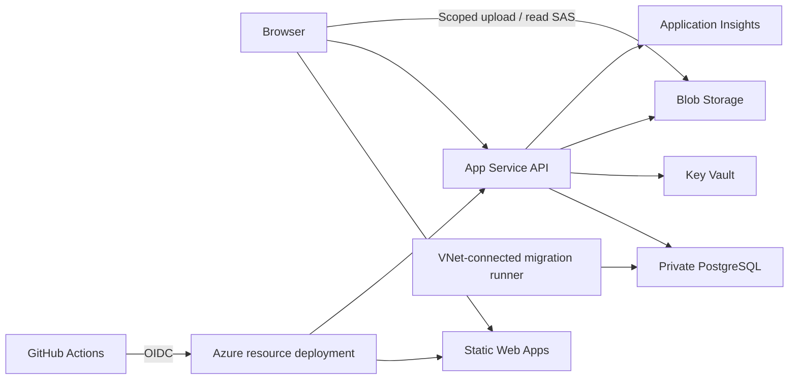

# Joviq Azure Deployment Plan

Prepared: 2026-10-01. Initial architecture proposal. Implementation now uses low-cost launch defaults and App Service WebJobs for private-network migrations; see `DEPLOYMENT_RUNBOOK.md` for the operational implementation and launch requirements. This file is at the repository root because the existing Git configuration ignores `docs/`.

## 1. Recommendation

Use Azure managed services and native application deployment, with GitHub Actions for CI/CD and Bicep for repeatable infrastructure. Keep the existing React, .NET, and PostgreSQL stack.

Interpret "less code" as minimal application changes, no server administration for the application, and one reusable infrastructure definition. Start with development and production; add a separate staging environment when release testing or team size justifies the recurring cost.

| Component | Azure service | Initial direction |
| --- | --- | --- |
| React/Vite frontend | Azure Static Web Apps | Free for nonproduction; Standard for production, subject to budget |
| .NET 10 API | Azure App Service, Linux | Native `dotnet publish` deployment; Basic for development, Standard or above for production slots |
| PostgreSQL database | Azure Database for PostgreSQL Flexible Server | Dedicated production server; smaller separate nonproduction server |
| Uploaded files and lesson media | Azure Blob Storage, StorageV2 | Private containers; short-lived signed access URLs |
| Secrets | Azure Key Vault | Separate vault per environment; App Service managed identity |
| Telemetry | Application Insights and Log Analytics | Request failures, latency, dependency tracking, bounded ingestion |
| Infrastructure | Bicep | Shared modules with environment parameter files |
| Delivery | GitHub Actions | OIDC login, environment gates, repeatable releases |

Prefer a region near the initial audience, such as Central India, only after checking service/runtime/SKU availability, residency needs, and regional pricing. Keep API, database, and storage in the same region.

Do not introduce Kubernetes, an application container registry, API Management, or Front Door for launch unless requirements justify them. Native App Service avoids application Dockerfiles and image maintenance. Container Apps remains an alternative if scale-to-zero becomes a stronger priority than deployment simplicity.

## 2. Architecture



Use the frontend and API as separate hosts initially. For example, if the domain is owned, use `app.joviq.com` and `api.joviq.com`, with separate nonproduction subdomains. This keeps the current JWT, refresh-cookie, and Google OAuth architecture intact. Configure HTTPS, exact CORS origins, cookie policy, and OAuth callback addresses explicitly.

A Static Web Apps linked backend is optional, not assumed. App Service backend linking requires the Static Web Apps Standard plan and must be tested against the existing authentication and callback routes before adoption.

Blob content must remain reachable from browsers for direct uploads/downloads. Private containers mean authorization is required; they do not imply disabling the storage account's public network endpoint. Configure Blob CORS for exact frontend origins. Keep public marketing assets in the frontend build initially.

## 3. Findings From This Repository

- `web/` is React/Vite; its output is `web/dist`. `VITE_API_BASE_URL` is currently configured for localhost.
- `api/` targets .NET 10. The SDK is pinned in `api/global.json`; CI must honor compatible SDK and package versions.
- EF Core uses Npgsql/PostgreSQL. Retain PostgreSQL; changing to Azure SQL would create unnecessary application and migration work.
- Storage supports `Local` and `AwsS3`, but no Azure Blob provider exists yet.
- Asset uploads already request a URL and use the returned HTTP method and headers, which is suitable for Azure SAS uploads.
- `Program.cs` seeds roles and LMS data during startup. It does not apply EF migrations there; the deployment must create/update the schema before application startup.
- `web/src/lib/api/httpClient.ts` logs login passwords. Remove this before any shared deployment.
- Development database credentials, a signing-key example, and a default admin password are in configuration. Remove deployable defaults, and rotate any values used outside local development.
- No GitHub Actions workflows or deployment infrastructure were found. A dedicated backend test project was not found in the inspected file list.

## 4. Minimal Application Changes

1. Add `AzureBlobAssetStorageProvider` behind the existing storage interface, with `Azure.Storage.Blobs` and `Azure.Identity`.
2. Authenticate storage access using App Service managed identity. Generate user-delegation SAS URLs scoped to one blob, operation, and short expiration. Include the Blob upload headers required by the frontend upload contract.
3. Authorize private lesson access through the API before issuing read SAS URLs. Verify uploaded object size and content metadata before marking an upload complete; SAS alone does not enforce the application's declared size limit.
4. Add liveness and readiness endpoints, such as `/health/live` and `/health/ready`. Readiness checks database connectivity without exposing secrets.
5. Remove password and token logging, reject missing production secrets, and keep development defaults out of deployment configuration.
6. Configure trusted proxy/forwarded headers for App Service before HTTPS redirection, OAuth, and IP-based rate limiting. Persist and protect ASP.NET Data Protection keys so restarts, instances, and slots do not invalidate authentication state unexpectedly.
7. Move production seeding into an explicit controlled initialization step. Make necessary seeds idempotent; do not reset administrator credentials or overwrite live catalog data on routine restarts.
8. Add frontend SPA route fallback configuration and environment-specific API origin configuration. Confirm cookie refresh and Google OAuth end-to-end on deployed domains.

Existing local/S3 assets need a separate transfer and metadata reconciliation step before switching providers. Do not assume selecting the Azure provider migrates existing files or stored asset URLs.

## 5. Environments and GitHub Controls

| Environment | Purpose | Deployment trigger | Data |
| --- | --- | --- | --- |
| Local | Developer work | Local commands | Local/synthetic data |
| `dev` | Integration and shared testing | Successful CI after merge to `main` | Isolated synthetic data; sandbox payments |
| `staging`, optional | Release rehearsal | Selected release candidate | Separate database/storage; masked data only |
| `production` | Live users | Manual promotion of an already validated commit | Dedicated production database/storage; live payments |

Use short-lived feature branches into protected `main`; require CI before merge. Avoid separate long-lived environment branches. Promote a commit/release rather than rebuilding from whatever `main` contains later.

Create GitHub environments with deployment branch restrictions, environment variables/secrets, and production required reviewers. Required reviewer availability depends on repository visibility and GitHub plan; verify before changing visibility. This repository is currently public.

Separate resource groups, identities, vaults, storage accounts, and databases for each deployed environment. Production should have its own App Service plan. Use separate subscriptions for production when governance or scale requires it.

An App Service release slot is not a substitute for an isolated staging environment. Slots share compute; schema and data changes are not reversed by a slot swap. A production release slot uses production-compatible configuration and production schema after the controlled migration step.

## 6. CI/CD Design

### Pull Request CI

- Frontend: pinned Node version, `npm ci` using the committed lockfile, TypeScript checks, and production build.
- Backend: restore the solution, compile with the pinned .NET SDK, and run focused unit/integration tests. Add tests for authentication, private asset access, upload completion, and critical payment flows before launch.
- Integration tests: disposable PostgreSQL, clean migration application, and upgrade checks against a representative prior schema.
- Infrastructure: Bicep build/lint. Run authenticated what-if only in a trusted workflow; do not expose Azure credentials to fork pull requests.
- Dependency/security scanning and artifact manifests with commit SHA. Pin external actions to reviewed commit SHAs.

### Infrastructure Workflow

1. Select environment and authenticate through GitHub OIDC.
2. Validate Bicep and present Azure what-if changes for review.
3. Apply approved infrastructure and configuration changes.
4. Export resource names/URLs as deployment outputs, without exporting secret values.

Infrastructure provisioning is separate from routine application releases. A bootstrap step creates the initial resource groups, OIDC trust, and scoped permissions; the workflow cannot create its own initial trust without an already authorized Azure identity.

### Application Release Workflow

1. Build/publish backend and frontend source from a recorded commit. Package an EF migration bundle and versioned release artifacts.
2. Deploy automatically to dev and run smoke tests.
3. Select the successful release for production and wait for the GitHub environment approval gate.
4. Confirm the migration risk review and backup/restore readiness, then execute migrations once using a deployment identity with schema privileges.
5. Deploy the API to the production release slot, check readiness and smoke tests, then swap when healthy.
6. Deploy the corresponding frontend build; verify routing, login/refresh, authorized lesson access, uploads, and payment callbacks.
7. Record the commit, artifact identifiers, migration version, and deployment result.

Use environment concurrency locks so releases and migrations cannot overlap. Build API artifacts once and promote the same package. Vite embeds environment variables at build time: either produce distinct frontend artifacts for each environment from the same commit, or add a small runtime configuration mechanism. Do not claim byte-identical frontend promotion while changing `VITE_API_BASE_URL`.

Private PostgreSQL cannot be reached by a normal GitHub-hosted runner. For the private-network production design, run migration execution on an ephemeral/self-hosted GitHub runner in the VNet, restricted to trusted deployment jobs, with start/stop/cleanup automation and a separate migration identity. Budget for this runner. An Azure Container Apps migration job is an alternative if introducing a migration container is acceptable. Choose and validate one execution method during implementation; do not open the database to all Azure services to make CI work.

For the lowest-cost launch variant, a public database endpoint with tightly restricted API outbound addresses and temporarily permitted deployment-runner addresses is possible, but changes the security model and requires reliable firewall cleanup. Private networking is the preferred production target.

### Rollback

- API: swap back to the prior healthy slot or redeploy the recorded prior artifact.
- Frontend: redeploy the prior compatible frontend artifact.
- Database: use additive/backward-compatible migrations so application rollback still works. Destructive migrations need a separate reviewed release and restore procedure.
- PostgreSQL point-in-time restore creates a restored server; recovery includes connection reconfiguration and validation. It is not an automatic in-place undo.

Frontend and API deployment are not atomic. Maintain API compatibility across adjacent frontend releases, and use feature flags for changes that require coordinated activation.

## 7. Identity, Secrets, and Settings

Use GitHub OIDC for Azure Login with `contents: read` and `id-token: write` permissions in deployment jobs. Bind federated trust to the intended repository/environment. Separate identities for resource provisioning, application deployment, database migrations, and application runtime; keep grants scoped to their jobs.

Runtime identity grants: Key Vault Secrets User on the environment vault; Blob data permissions at the appropriate container scope plus the account-level ability to request user delegation keys. Do not grant subscription Owner to application or delivery identities. Initial role assignments require an authorized bootstrap operator or specifically scoped role-assignment identity.

The standard Static Web Apps deployment action uses a deployment token. Keep one token per environment in GitHub environment secrets and rotate it. OIDC for Azure does not automatically replace this action's deployment token.

Use App Service Key Vault references for database credentials, JWT signing keys, SMTP credentials, Google client secrets, and payment provider secrets. This avoids adding Key Vault retrieval code to the API. Initially retain password-based PostgreSQL connections in Key Vault to minimize code changes; managed-identity PostgreSQL access can follow with token refresh and database role setup.

| Setting | Location |
| --- | --- |
| `AZURE_CLIENT_ID`, `AZURE_TENANT_ID`, `AZURE_SUBSCRIPTION_ID` | GitHub environment variables; identifiers, not passwords |
| Static Web Apps deployment token | GitHub environment secret |
| `VITE_API_BASE_URL` | Frontend build configuration; public, never a secret |
| `ASPNETCORE_ENVIRONMENT` | App Service; Production for the live API |
| `ConnectionStrings__DefaultConnection` | App Service Key Vault reference, PostgreSQL TLS enabled |
| `Jwt__SigningKey` | App Service Key Vault reference |
| `Cors__AllowedOrigins__0` | App Service setting; exact environment frontend origin |
| Azure Blob provider/account/container configuration | App Service settings after adapter implementation |
| Google callbacks, frontend callback URL, payment environment | Environment-specific App Service/provider settings |

Never put secrets in `VITE_*`: they become browser-visible. Keep payment sandbox and production keys/webhooks separate. Azure hosting does not replace the existing Google, SMTP, Cashfree, or Razorpay account configuration.

## 8. Operations and Cost

- Enable PostgreSQL automated backups; propose 14-day production retention, then confirm business requirements. Perform a restore drill before launch.
- Enable Blob soft delete/versioning and an explicit lifecycle policy. Account for versioned media storage and download egress; do not archive actively used lessons.
- Alert on API availability, 5xx errors, latency, database storage/CPU, failed deployments, and failed payment webhooks. Sample/cap telemetry and redact sensitive data.
- Track resource tags (`application`, `environment`, `owner`) and monthly budgets with thresholds, for example 50%, 80%, and 100%. Budget alerts do not impose a spending cap.
- Production deployment slots require App Service Standard, Premium, or Isolated tiers. Basic development plans do not support slots; production on Basic requires direct deployment/redeployment rollback with possible downtime.
- Start with one production API instance only if the business accepts reduced availability. Multiple instances and PostgreSQL high availability need a separate reliability budget; slots alone do not provide high availability.
- Price the API plan, database compute/storage/backups, Blob capacity/transactions/egress, SWA plan, monitoring ingestion, migration runner, and GitHub Actions usage. Exact monthly INR cost requires the chosen region, SKUs, uptime, storage, and traffic; do not treat an unverified estimate as a quote.
- A third always-on environment materially increases cost. Start with local + dev + production if release rehearsal does not yet need dedicated staging.

## 9. Implementation Order and Deliverables

1. Confirm Azure subscription/tenant, budget, region, domain ownership, initial traffic/media volume, and environment count; complete GitHub CLI account sign-in.
2. Fix deployment blockers and add the Azure Blob provider, health endpoints, secure configuration, and focused tests.
3. Add reusable Bicep modules and dev/production parameter files. Provision dev first and document bootstrap/OIDC permissions.
4. Add PR CI and dev deployment workflows. Verify a clean database migration and full login/upload/payment sandbox flow.
5. Provision production, private database networking, migration execution, secrets, DNS/TLS, monitoring, and backup policies.
6. Add protected release promotion, production slot deployment, smoke checks, and rollback workflow. Rehearse application rollback and database restore.
7. Launch only after acceptance checks pass and ownership of alerts/recovery is assigned.

Planned files, not yet implemented:

```text
infra/main.bicep
infra/modules/*.bicep
infra/environments/dev.bicepparam
infra/environments/production.bicepparam
.github/workflows/ci.yml
.github/workflows/infra.yml
.github/workflows/deploy.yml
.github/workflows/rollback.yml
web/public/staticwebapp.config.json
docs/DEPLOYMENT_RUNBOOK.md
```

Acceptance: infrastructure is reproducible; production secrets are absent from source/browser bundles; dev cannot access production data; releases require passing CI and configured approval; migrations run once; SPA routes and authentication work; private lesson access is enforced; file uploads survive redeployment; payment webhooks work; health/alerts are visible; rollback and restore have been demonstrated.

## 10. Official References

- [ASP.NET deployment on App Service](https://learn.microsoft.com/en-us/azure/app-service/quickstart-dotnetcore)
- [App Service deployment slots and supported tiers](https://learn.microsoft.com/en-us/azure/app-service/deploy-staging-slots)
- [Static Web Apps linked App Service backend](https://learn.microsoft.com/en-us/azure/static-web-apps/apis-app-service)
- [Static Web Apps build/deployment configuration](https://learn.microsoft.com/en-us/azure/static-web-apps/build-configuration)
- [GitHub OIDC with Azure](https://docs.github.com/en/actions/how-tos/secure-your-work/security-harden-deployments/oidc-in-azure)
- [GitHub deployment environments and protection availability](https://docs.github.com/en/actions/reference/workflows-and-actions/deployments-and-environments)
- [Bicep deployment what-if](https://learn.microsoft.com/en-us/azure/azure-resource-manager/bicep/deploy-what-if)
- [App Service secure resource connections](https://learn.microsoft.com/en-us/azure/app-service/tutorial-connect-overview)
- [Azure Blob Storage authorization](https://learn.microsoft.com/en-us/azure/storage/blobs/authorize-access-azure-active-directory)
- [Browser upload with managed identity and user-delegation SAS](https://learn.microsoft.com/en-us/azure/developer/javascript/tutorial/browser-file-upload-azure-storage-blob)
- [PostgreSQL private networking](https://learn.microsoft.com/en-us/azure/postgresql/network/concepts-networking-private)
- [PostgreSQL backup and restore](https://learn.microsoft.com/en-us/azure/postgresql/backup-restore/concepts-backup-restore)
- [Static Web Apps pricing](https://azure.microsoft.com/en-us/pricing/details/app-service/static/)
